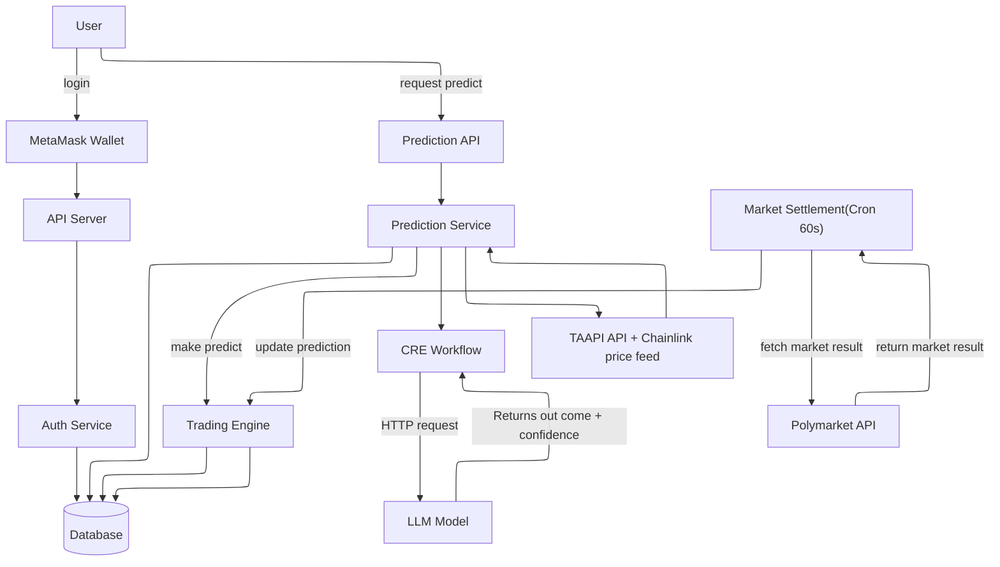
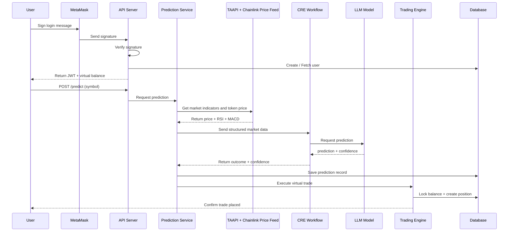
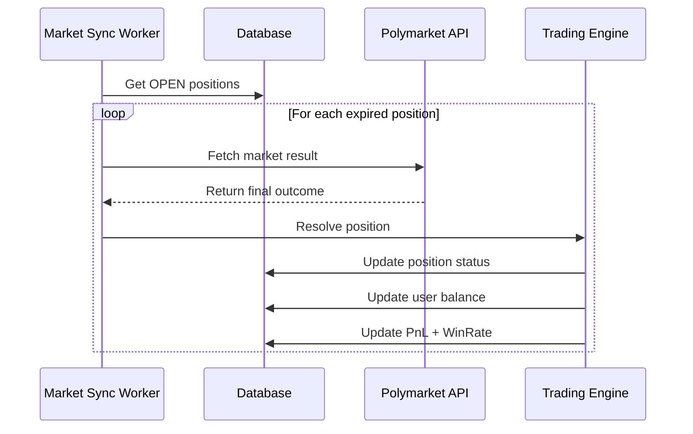
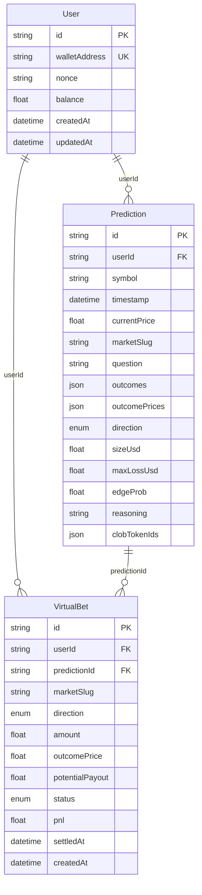

# Prediction Bot —  System Architecture & Workflow (Mermaid)

---

## 1. System Architecture 

```mermaid
---
config:
  layout: elk
---
flowchart TB
    User["User"] -- login --> MetaMask["MetaMask Wallet"]
    MetaMask --> APIGW["API Server"]
    APIGW --> Auth["Auth Service"]
    Auth --> DB[("Database")]
    User -- request predict --> PredictAPI["Prediction API"]
    PredictAPI --> PredictionService["Prediction Service"]
    PredictionService -- make predict --> TradingEngine["Trading Engine"]
    PredictionService --> CRE["CRE Workflow"] & DB & TAAPI["TAAPI API + Chainlink price feed"]
    TAAPI --> PredictionService
    CRE -- HTTP request --> LLM["LLM Model"]
    LLM -- Returns out come + confidence --> CRE
    TradingEngine --> DB & DB
    MarketSync["Market Settlement(Cron 60s)"] -- fetch market result --> Polymarket["Polymarket API"]
    MarketSync -- update prediction --> TradingEngine
    Polymarket -- return market result --> MarketSync
```

---

## 2. Flow: Predict

```mermaid
sequenceDiagram
    participant U as User
    participant MM as MetaMask
    participant API as API Server
    participant PS as Prediction Service
    participant TA as TAAPI + Chainlink Price Feed
    participant CRE as CRE Workflow
    participant LLM as LLM Model
    participant TE as Trading Engine
    participant DB as Database

    %% Login Flow
    U->>MM: Sign login message
    MM->>API: Send signature
    API->>API: Verify signature
    API->>DB: Create / Fetch user
    API-->>U: Return JWT + virtual balance

    %% Prediction Flow
    U->>API: POST /predict (symbol)
    API->>PS: Request prediction

    %% Fetch market data
    PS->>TA: Get market indicators and token price
    TA-->>PS: Return price + RSI + MACD

    %% AI Prediction
    PS->>CRE: Send structured market data
    CRE->>LLM: Request prediction
    LLM-->>CRE: prediction + confidence
    CRE-->>PS: Return outcome + confidence

    %% Store prediction
    PS->>DB: Save prediction record

    %% Execute trade
    PS->>TE: Execute virtual trade
    TE->>DB: Lock balance + create position
    TE-->>U: Confirm trade placed
```

---

## 3. Flow: Settlement (Cron )

```mermaid
sequenceDiagram
    participant CRON as Market Sync Worker
    participant DB as Database
    participant PM as Polymarket API
    participant TE as Trading Engine

    CRON->>DB: Get OPEN positions
    loop For each expired position
        CRON->>PM: Fetch market result
        PM-->>CRON: Return final outcome

        CRON->>TE: Resolve position
        TE->>DB: Update position status
        TE->>DB: Update user balance
        TE->>DB: Update PnL + WinRate
    end
```

---

## 4. Data Model (Prisma)

```mermaid
erDiagram
    User ||--o{ Prediction : "userId"
    User ||--o{ VirtualBet : "userId"
    Prediction ||--o{ VirtualBet : "predictionId"

    User {
        string id PK
        string walletAddress UK
        string nonce
        float balance
        datetime createdAt
        datetime updatedAt
    }

    Prediction {
        string id PK
        string userId FK
        string symbol
        datetime timestamp
        float currentPrice
        string marketSlug
        string question
        json outcomes
        json outcomePrices
        enum direction
        float sizeUsd
        float maxLossUsd
        float edgeProb
        string reasoning
        json clobTokenIds
    }

    VirtualBet {
        string id PK
        string userId FK
        string predictionId FK
        string marketSlug
        enum direction
        float amount
        float outcomePrice
        float potentialPayout
        enum status
        float pnl
        datetime settledAt
        datetime createdAt
    }
```