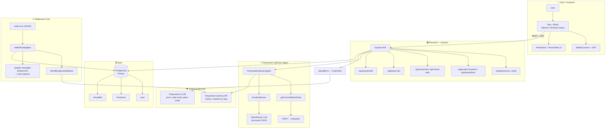
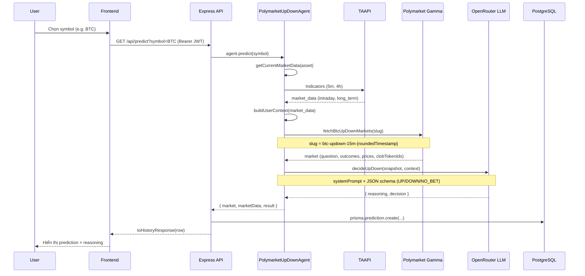
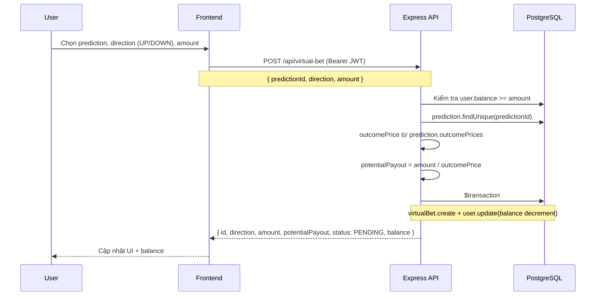
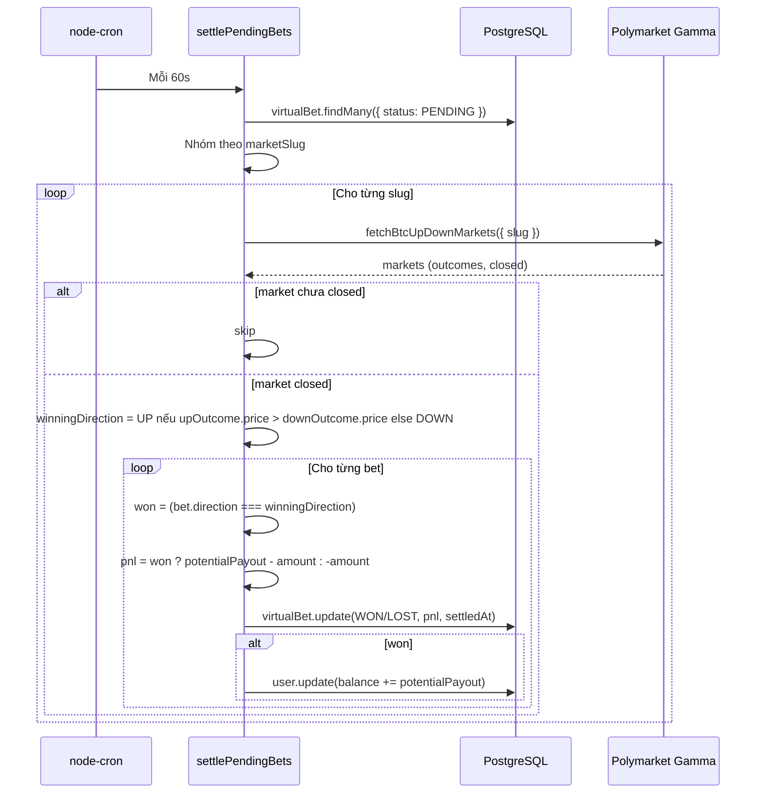
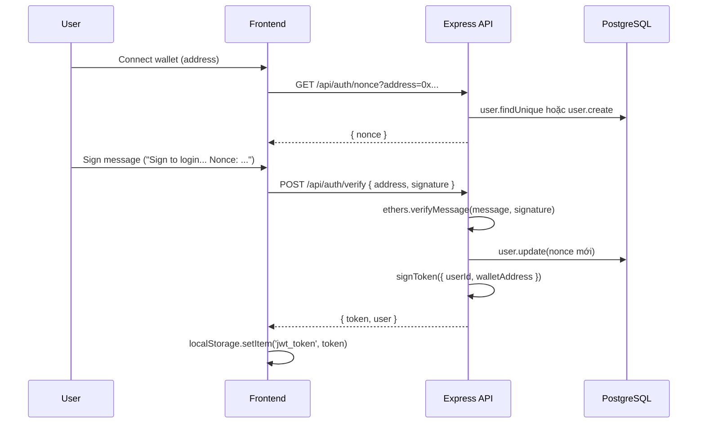
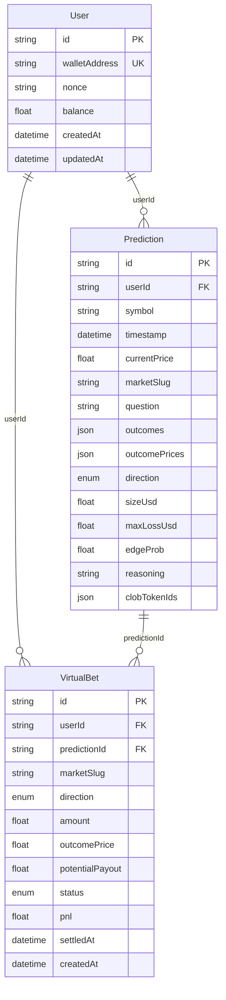

# Prediction Bot — Kiến trúc & Workflow (Mermaid)

Tài liệu tham khảo kiến trúc từ [CRE × GCP Prediction Market Demo](https://github.com/smartcontractkit/cre-gcp-prediction-market-demo), áp dụng cho dự án **prediction-bot** của bạn.

---

## 1. System Architecture (Kiến trúc hệ thống)

---

## 2. Flow: Predict (Lấy dự đoán UP/DOWN)

---

## 3. Flow: Virtual Bet (Đặt cược ảo)

---

## 4. Flow: Settlement (Cron giải quyết cược ảo)

---

## 5. Flow: Auth (Wallet Connect + JWT)

---

## 6. Data Model (Prisma)

---

## 7. So sánh nhanh với CRE × GCP Demo

| Khía cạnh | CRE × GCP Demo | Prediction Bot (của bạn) |
|-----------|----------------|---------------------------|
| **Settlement** | On-chain (CRE detect event → Gemini → onReport) | Off-chain cron: Polymarket Gamma (market closed) → cập nhật DB |
| **AI** | Gemini (fact-check, search grounding) | OpenRouter LLM + TAAPI (technical indicators) |
| **Market data** | SimpleMarket.sol (Sepolia) | Polymarket Gamma + CLOB |
| **Cược** | USDC on-chain, claim thưởng on-chain | Virtual (balance trong DB) hoặc place order thật qua CLOB |
| **Frontend** | Next.js + Firestore | Vite + React + Express API + PostgreSQL |

---

*Dự án: prediction-bot — Tham khảo kiến trúc từ [cre-gcp-prediction-market-demo](https://github.com/smartcontractkit/cre-gcp-prediction-market-demo)*
